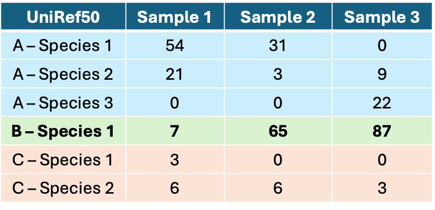

# Determining which taxa correspond to which functions

When running picrust2, the software takes each taxon, finds the closest published genome, and assumes that your taxon has the same genes.

This means that each function's counts can be broken down into the individual taxa that make up the function - no need to statistically correlate taxa and functions together!

We can extract the 'stratified' version of the picrust output. Typically people analyze these data without any additional statistics - just a cutoff or two to identify the taxa that contribute particularly strongly.

**The following approach will take a list of interesting functions and determine which taxa contribute the most reads to them.** Note that the following instructions will not tell you how to run EVERY step - you'll have to do some web searches. I recommend trying this approach and then troubleshooting with your team and TA as needed.

## Analytical Approach

You’ll need to rerun picrust2 so that it gives you ’stratified’ data. Instead of the typical function vs. sample output, it’ll look like this, where each capital letter is a function (the column name will be different as well):

You’ll have to use some data wrangling from Module 10 to separate the column into functions and taxa (this won’t go into the proposal or your manuscript’s methods).

Next, you’ll filter the pathways (remember to specify where you're getting the pathway list - you might have pathways you've decided a priori are relevant to your question, or they might be differentially abundant.

The next part needs to be performed per sample and per function (i.e. add both of these to group_by). For each combination, you’ll calculate the proportion of reads that belongs to each taxon (i.e. a manual % calculation).

The next part is done per function and per taxon: calculate the average proportion across all your samples.

Then, filter to include only the taxa that have an average proportion \>=33% for a given function. These taxa are considered 'significant contributors to the function's abundance within the cohort'. This isn’t a statistical measure - you’ll just have information that describes which taxa contribute the most to each of your pathways of interest, where the taxa and functions may or may not be significant as per your other aims.

Note: feel free to change the 33% cutoff if needed - too low and you’ll have too many taxa, too high and you won’t have enough.

Depending on how many functions you’re looking at and whether they cluster into smaller groups, you might want to format the results as a table. The columns and rows would denote the taxa and the functions (or groups of functions), and the value could be the average proportion, for example. You could also turn this into a figure similar to a taxonomic bar plot, where each bar is one function. There are lots of ways you could do it, feel free to come up with a better solution once you see the results!

Notably, you don’t need to normalize the reads. This is because we’re looking at how the reads are distributed across taxa WITHIN each sample, meaning that whether you rarefy, convert to relative abundance, or leave as-is, the proportion of each function’s reads that belong to each taxon should remain pretty much consistent. 

## Example publication:

Under input from Dr. Laura Sycuro from UCalgary, I published this method in this paper: <https://movementdisorders.onlinelibrary.wiley.com/doi/full/10.1002/mds.29959> You can see the results in "Reads that Map to F. prausnitzii Contribute Significantly to More than Half of all Differentially Abundant Functional Terms". The results were formatted as a table, and I included a ’sensitivity analysis’ that tested cutoffs other than 33% to ensure I wasn’t accidentally biasing my results. Feel free to use that approach if you like.
